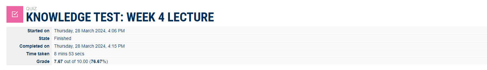

# Week 4 | Internetworking

## Task 1. Complete the Knowledge Test

## Task 2. View Routing Table

All adapters are generated by "Get-NetAdapter".

Every single detail of the routing table
Command, "Get_NetRoute-ifIndex 11",  

255.255.255.255/32  =   Broadcast address connected with one host.  
224.0.0.0/4       =    Multicast address identified for  one-to-many communication.  
10.162.35.255/32    =  Direct Broadcast address used for data transmission.  
10.162.32.65/22     =   Specific Host address of a system. 
10.162.32.0/22    =   Network address assigned the IP 10.162.35.61/32. 
10.162.32.1      =     Gateway IP address used for the communication. 

## Task 4. IP Network Design

Names of my team members are 

Nasrin Amin
ID: 12240095 
Manoj Kumar K C
ID : 12248791  

a) IPv4 network addresses and assigning IP addresses to all devices. I have included a table 
listing  devices and assigned IPs.  
I have used the last four digits of my student ID for decimal values on LAN 1, and for  LAN 2, I have used my partner's ID.  

My student ID is 12240095. Since the last 4 digits of my id start with 00, I have replaced it with 11. So, it gives an IP of 11.95.0.0/24.
WAN and unknown values I have chosen randomly. 
My partner's IP is 12248791 which gives an IP of 87.91.0.0/24,
The IP Network Design.

b)  The Network diagram,

c) The routing tables for every device are in the below tables, sequencing routing table by routing table 1, 2, 3, 4, 

d) If a host on one LAN sent an ICMP packet (e.g., ping request) to a host on the other LAN, and that 
packet was captured at a router. The addresses in the packet have been shown clearly.

If a host on one LAN sent an ICMP packet (e.g., ping request) to a host on the other LAN, and that 
packet was captured at a router, then draw the packet ICMP/IP. Indicate the addresses in 
the packet. MAC addresses would be in the Ethernet frame of the packet described here,

The  packet ICMP/IP drawio.net file,

## Task 5. IP Address Lookup

After using the website "whatismy.com" to search for my IP, I learned a lot about it. It provides precise descriptions of every IP address. My location is also detected by the website.
138.77.214.61 is the IP address of IPv4, which I obtained from my university lab computer.
Melbourne, VIC AU is the IP address I'm using.

Central Queensland University is my ISP. 

The network provider of my home is a local IPv4 network provided by my local internet provider. IPv4 240.280.47.628 is the public IP address that I obtained from my home computer. 
Location of my IP: Sydney, NSW, AU  
Dodo Internet Pty Ltd is the ISP. 

## Task 6. IP Addresses, VPNs and Contract Cheating

a)Bypassing Geolocation Services with a VPN:

Access to Restricted Content: VPNs can help users access content that is geographically restricted, such as streaming services or websites limited to specific regions.
Enhanced Privacy: VPNs encrypt internet traffic, providing an additional layer of privacy and security, making it more challenging for third parties to monitor online activities.
Circumventing Censorship: In some countries, certain websites and services may be censored. A VPN can be used to bypass such censorship and access unrestricted information. 
Legal and Ethical Concerns: Bypassing geolocation services may violate terms of service agreements and, in some cases, be against the law.
  

b) University Using IP Addresses to Identify Contract Cheating:
Monitoring Anomalies: Analyzing IP addresses can help identify patterns and anomalies in user behaviour, potentially flagging instances of multiple users accessing the same assignment or exam from different locations.
Privacy Concerns: Monitoring IP addresses raises privacy concerns as it involves tracking the online activities of individuals, which may be considered an invasion of privacy.
Shared Connections: IP addresses can be shared among multiple users, such as in dormitories or public spaces, leading to false positives and misidentifications.
Evasion Techniques: Students might use VPNs or other methods to mask their IP addresses, making it challenging to rely solely on this method for detecting contract cheating. 

c) Advice for Students Using a VPN in Australia:
Legal and Ethical Awareness: Understand the legal and ethical implications of using a VPN. Ensure that your usage complies with local laws and regulations.
Choose Reputable VPN Providers: Select a trustworthy VPN service that prioritizes user privacy and has a good reputation for security.
Consider University Policies: Be aware of your university's policies regarding VPN usage. Some institutions may have specific guidelines or restrictions.
Balancing Privacy and Responsibility: While VPNs offer privacy, use them responsibly. Avoid engaging in any activities that may violate academic integrity or legal standards.
 

Bypassing Geolocation Services with a VPN:

Access to Restricted Content: VPNs can help users access content that is geographically restricted, such as streaming services or websites limited to specific regions.
Enhanced Privacy: VPNs encrypt internet traffic, providing an additional layer of privacy and security, making it more challenging for third parties to monitor online activities.
Circumventing Censorship: In some countries, certain websites and services may be censored. A VPN can be used to bypass such censorship and access unrestricted information.
Security Risks: Using a VPN can introduce security risks, especially if the service is not reputable. Users should be cautious about potential data breaches and malicious activities.
Network Performance: VPNs can sometimes lead to slower internet speeds due to the added encryption and routing processes.  

 University Using IP Addresses to Identify Contract Cheating:

Monitoring Anomalies: Analyzing IP addresses can help identify patterns and anomalies in user behaviour, potentially flagging instances of multiple users accessing the same assignment or exam from different locations.
Deterrent Effect: The knowledge that IP addresses are monitored may act as a deterrent, discouraging students from engaging in contract cheating.
Privacy Concerns: Monitoring IP addresses raises privacy concerns as it involves tracking the online activities of individuals, which may be considered an invasion of privacy.
Shared Connections: IP addresses can be shared among multiple users, such as in dormitories or public spaces, leading to false positives and misidentifications.  

 Advice for Students Using a VPN in Australia:
Legal and Ethical Awareness: Understand the legal and ethical implications of using a VPN. Ensure that your usage complies with local laws and regulations.
Consider University Policies: Be aware of your university's policies regarding VPN usage. Some institutions may have specific guidelines or restrictions.
Balancing Privacy and Responsibility: While VPNs offer privacy, use them responsibly. Avoid engaging in any activities that may violate academic integrity or legal standards.

