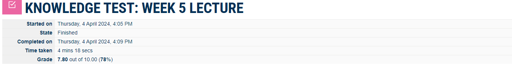
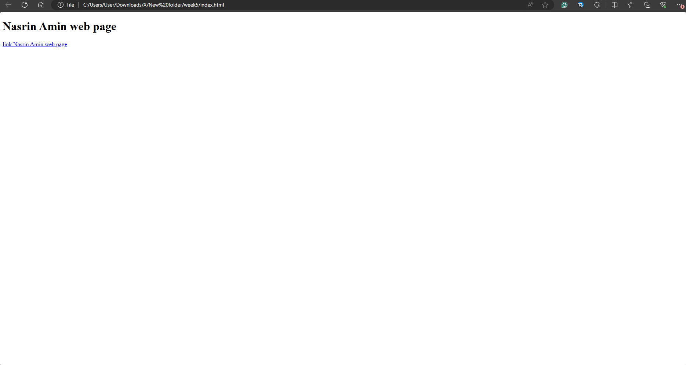
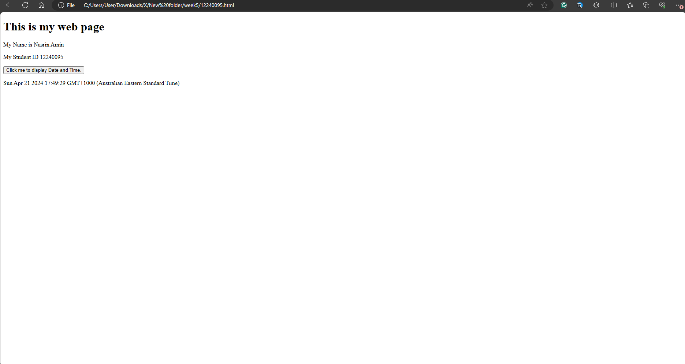
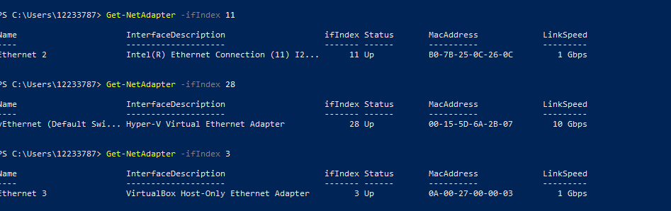
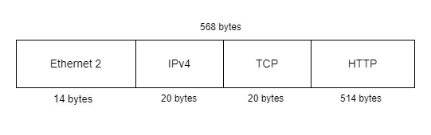

# Week 5 | Tutorial Activities

## Task 1. Complete the Knowledge Test

The screenshot of the details:

## Task 2. Create Web Pages in OpenWRT

Assuming you have an index.html file, you can copy it to a new file named by your student ID. For example, if your student ID is 12240095:

Open the index.html file in a text editor and add a link to the new HTML file. Add something like this inside the <body> tag:

<a  href="html/index.html"> index.html </a>

Open the 12240095.html file in a text editor and add your details and a button that displays the date/time when clicked. Also, link to a new CSS file. For example:

<a  href="html/12240095.html"> 12240095.html </a>

Now, when you open index.html in a web browser, you should see a link to your new HTML file (12240095.html). Clicking the button on the new HTML page will display 
The screenshot of the web browser is as follows,

## Task 3. Capture HTTP Packets 

 OpenWRT and stop the capture by there are  96 packets 
captured … 0 packets dropped by kernel”. 

PowerShell to view the ARP Table for your primary physical interface  on your 
computer. Communicate with other devices on your LAN
The http-12240095.pcap is as follows,

<a  href="pcap/http-12240095.pcap"> Click here for the http-12240095.pcap file! </a>

The following is a screenshot of the ARP table details:

## Task 4. Analyse HTTP Packet Capture 

a) Explanation of HTTP Request/Response:

Trigger: User action (e.g., clicking a link or button).
Request: What the client (browser) is asking for (e.g., a specific URL).
Response: What the server provides in return (e.g., HTML content or an error message).

b) First HTTP Request/Response - Address Values:

Host: IP address or domain name of the server.
Transport Protocol: Usually TCP (Transmission Control Protocol).
Application: Typically port number 80 for HTTP. </b>

c) Date and Time Button Click:

If the button triggers an action within the client (browser) only, it might not necessarily send a request to the server. JavaScript can handle this locally.

d) Packet Diagram for 12240095.html:

The diagram is  possible without specific packet capture data.

Header size depends on specific headers present (e.g., HTTP header, TCP/IP header).
Addresses can be  Source IP, Source Port, Destination IP, or Destination Port.
Here is the IP source and destination and MAC source and destination:

Source IP Address:	192.168.56.2	
Destination IP Address: 192.168.56.1	

Source Mac Address: (08:00:27:39:c3:c2)
Destination Mac Adress: (0a:00:27:00:00:08)

e) Referrer in HTTP Request:

The referrer identifies the source URL of the current request.
Web servers use this to know where the request originated.

f) Server Learning about Browser:

User-Agent header provides information about the browser.

Request URL name: 12240095.html
Host: 192.168.56.2\r\n

Request Version: HTTP/1.1

User-Agent: Mozilla/5.0 (Windows NT 10.0; Win64; x64) AppleWebKit/537.36 (KHTML, like Gecko) Chrome/120.0.0.0 Safari/537.36 Edg/120.0.0.0\r\n

g) HTTP Version and Transport Protocol:

Look for HTTP/1.x in the packets for the version.
TCP is the common transport protocol.

h) Connection Setup and Duration:

Identify the packets involved in the TCP three-way handshake for connection setup.
Calculate the time between the first packet and the beginning of the data transfer.

i) Acknowledgments in TCP:

Acknowledgments are typically part of the TCP protocol.
Look for ACK flags in TCP packets.
Acknowledgments are sent by the receiver to confirm the received data.
Refer to specific packet numbers, times, and other values from your capture to answer the questions thoroughly.

## Task 5. View Your Cookies

Cookies are small pieces of data that websites store on your browser. They serve various purposes, including session management, personalization, and tracking user behavior. Here are common types of information stored in cookies:

Session Information: Cookies often store session identifiers that help maintain user sessions between page visits. This allows websites to recognize you as the same user as you navigate through different pages.

If you log into a website, cookies may store information related to your authentication status, preventing you from having to log in repeatedly.

Preferences and Settings: Websites may use cookies to remember your preferences and settings, such as language preferences, layout preferences, or theme choices.

 Some cookies are used for tracking user behavior and gathering analytics data. This information helps website owners understand how users interact with their site.

Third-party cookies, often used for advertising purposes, may store information about your browsing habits to deliver targeted ads. This could include information about the types of products or content you've shown interest in.

Cookies can be used for security purposes, such as preventing Cross-Site Request Forgery (CSRF) attacks or ensuring secure connections.

User Tracking Across Devices: In some cases, cookies may be used to track a user's activity across different devices for a more seamless experience.

