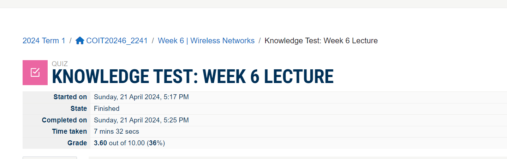

# Week 6 | Tutorial Activities

## Task 1. Complete the Knowledge Test

The screenshot of the details:

## Task 2. View Wi-Fi Details

Explore the Wi-Fi details of your own device. This would provide details such as SSID, BSSID (MAC address of the Access Point), frequency band, channel, and data rate.

If you're using an Android device and the WiFi Analyzer app, you can typically find information about nearby Access Points by launching the app and checking the list of networks. The information usually includes SSID, BSSID, frequency band, channel, and signal strength.

Here's an example of what you might find below,

We have multiple networks the AP network is called eduroam. Which is the AP of CQU, Sydeny's wifi network . 

From the Wifi Analyzer application, I have found the following information.  

Network name: eduroam  

Frequency: 2404 MHz  
Security : WPA2-EAPCCMP  

## Task 3. Use Wi-Fi Access Point

When designing a Wi-Fi network, consider the following important settings:
Consideration: Choose a unique and easily identifiable SSID.
 A clear and recognizable SSID makes it easier for users to identify and connect to the correct network.
Security Settings
Use WPA3 encryption for enhanced security.
 WPA3 provides stronger security measures compared to its predecessors, helping to protect the network from unauthorized access.

Use a strong and unique passphrase.
Why: A strong passphrase adds an extra layer of security and prevents unauthorized access.
Wireless Channel and Frequency:
Choose the least congested channel.
 Avoiding channel interference improves network performance. Tools like Wi-Fi analyzers can help identify the least congested channels
Select the appropriate wireless mode (e.g., 802.11ac) and band (2.4 GHz or 5 GHz).
Higher wireless modes and 5 GHz bands generally offer better data rates and reduced interference.
Enable a guest network for visitors.
Isolating guest traffic enhances security and prevents guests from accessing the main network.
Screenshot of AP settings.

The following is a screenshot of the details:

## Task 4. Self-Evaluation of Teamwork

Problems Encountered in the Project So Far:
Communication Challenges:
The team faced issues with communication, including delays in responding to emails and missed meetings.
This led to misunderstandings, delays in task completion, and a lack of clarity on project goals.
Resource Constraints:
Limited access to specific tools or data hindered progress on certain tasks.
Slowed down the project timeline and required alternative solutions to overcome resource limitations.
Differing Work Styles:
Varied work styles and preferences among team members led to differences in task prioritization and execution.
Coordination challenges and occasional friction between team members.
Reflection on Team Membership:
As a team member, it's essential to reflect on how your actions and behaviors contribute to the team dynamic. Here's how your team might describe you:
Actively contributing ideas and insights during team meetings. Meeting deadlines and ensuring the quality of assigned tasks.
Taking ownership of assigned tasks, meeting deadlines, and communicating proactively about progress and challenges.
Demonstrating dedication to the project by actively participating in discussions, contributing ideas, and putting in extra effort when needed.
Self-reflection: Approaching disagreements as opportunities for constructive discussion, providing rationale for opinions, and working towards consensus.
Self-reflection: Building trust by consistently delivering on commitments, being transparent about challenges, and collaborating openly with team members.

Team members may perceive attentiveness through active participation, timely completion of tasks, and a demonstrated understanding of the project's goals.
Demonstrating responsibility involves taking ownership of tasks, communicating effectively, and ensuring that commitments are met. This builds trust among team members.
Commitment is showcased through consistent effort, dedication to achieving project goals, and a willingness to go above and beyond when necessary.
Being open to different perspectives, engaging in respectful discussions, and working towards solutions instead of avoiding conflicts establishes a positive team dynamic.
Trust is built over time through consistent actions, honesty about challenges, and a reliable track record of delivering on commitments.

## Task 5. Continue Your Project

I have continued my project with my team members. All of was worked very hard for this. Meanwhile, during the tutorial, we discussed the project with our tutor and followed his guidelines.

