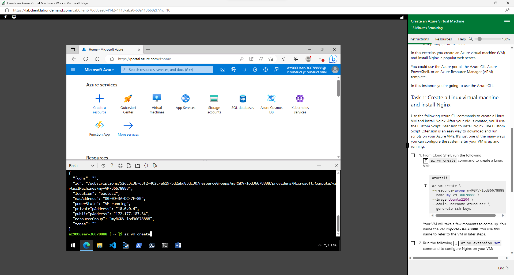
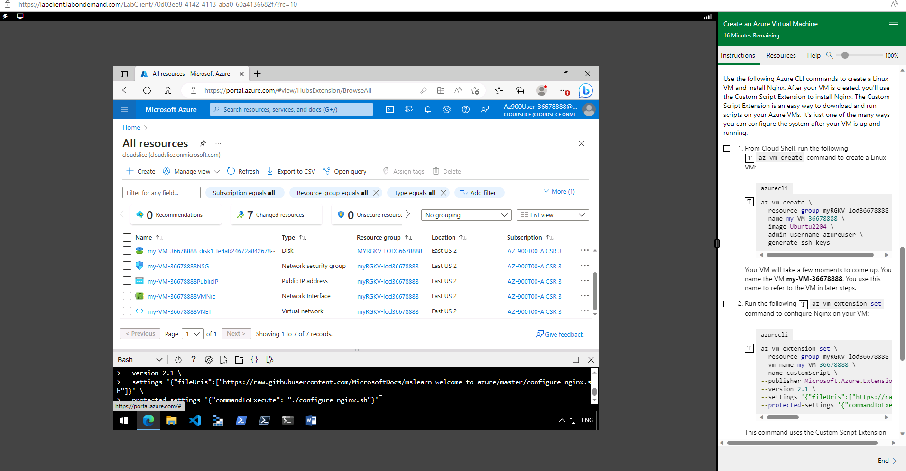
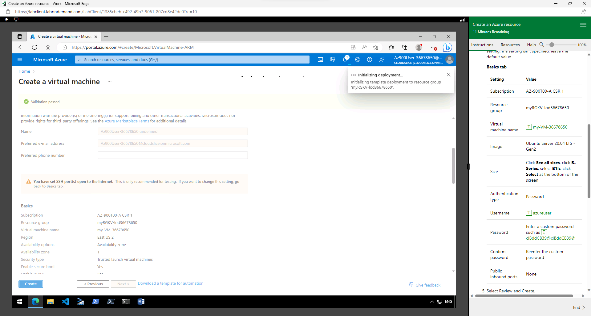
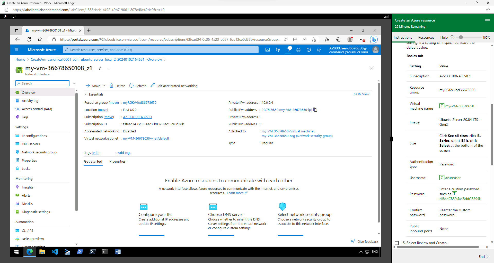
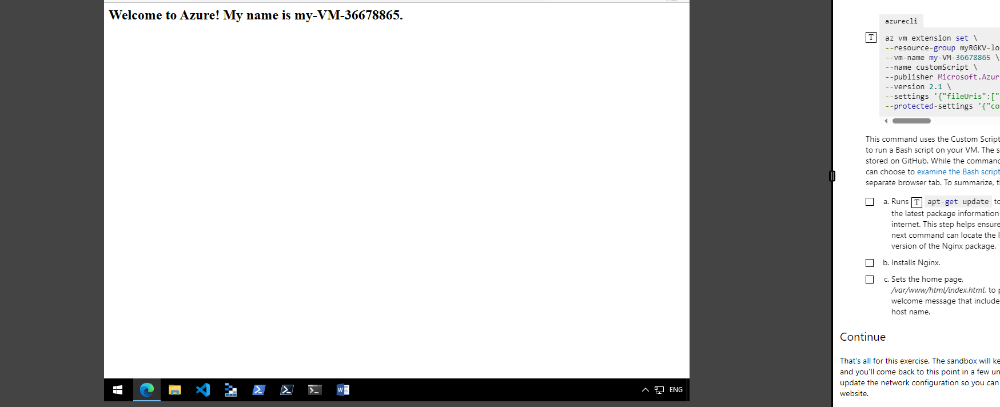

# Week 7 | Tutorial Activities

## Task 1. Complete the Knowledge Test

The screenshot of the details:

## Task 2. Login to Microsoft Learn on Demand

I logged in to Microsoft Learn on Demand
Go to https://msle.learnondemand.net/ and select Register with Training Key, using the key provided on 
Moodle. Register with cqumail.com address to create a Skillable account. I Log out and then log in 
again but this time selecting “Sign In” and “Skillable Account”. 

Once logged in, I entered the class COIT20246, and it will take me to Microsoft Azure. The following is a screenshot of the details:

then I entered into the Microsft Azure website server.

## Task 3. Create an Azure Resource 

I will create an Azure resource. Continuously I have followed the instructions in Microsoft Learn On Demand.

I Listed the resources that were created and gave a short explanation of what each resource is for them,

logging into the Microsft Learn to Demand, went to the browser. Go to the link provided portal.azure.com from the instructions given.

The following is a screenshot of the details:

After reaching the website I have to provide Microsoft Azure sign-in details. With given 
Username and  Password are provided inside the instructions.

Proving these details took me to the Microsoft Azure portal for the Azure Resource interface. There will be a welcome message called Welcome to Microsft Azure.

The following is a screenshot :

## Task 4. Create an Azure Virtual Machine and Allow Web Access

I have to be logged in, to edit the web page run:
sudo nano /var/www/html/index.html
Then add your name to the HTML. Save with Ctrl-O and exit with Ctrl-X.
 
Copy the az commands used to create the VM and install Nginx (copy the commands into your 
journal, so you can copy-and-paste them in the future; do not use a screenshot). 

The following is a screenshot :

Record the public IP address of your VM.
Include a screenshot of your web browser successfully accessing your website 
There are two network security rules that allow access to your VM. For each rule, give the port 
number and explain what that rule allows 

The az commands used to create the VM and install Nginx are as follows below,

The following is a screenshot :

az vm create

azurecli az vm create
--resource-group myRGKV-lod36678865
--name my-VM-36678865
--image Ubuntu2204
--admin-username azureuser
--generate-ssh-keys

Command to configure Nginx on VM

az vm extension set
--resource-group myRGKV-lod36680376
--vm-name my-VM-36680376
--name customScript
--publisher Microsoft.Azure.Extensions
--version 2.1
--settings '{"fileUris":["https://raw.githubusercontent.com/MicrosoftDocs/mslearn-welcome-to-azure/master/configure-nginx.sh"]}'
--protected-settings '{"commandToExecute": "./configure-nginx.sh"}'

The following is a screenshot of the details after sowing my VM name in the website

SSH Access
Port Number: 22
Allows Secure Shell, and SSH access to the Virtual Machine. SSH is a network protocol that provides a secure way to remotely access the VM command interface, used for server and  data transmission. Explanation: This rule allows inbound traffic on port 22, typically used for SSH. SSH is a secure protocol used for remote access to Linux-based VMs. Allowing this rule enables you to connect to your VM securely and manage it through a command-line interface.

HTTP Access
Port Number: 80
Login to the Ubuntu VM with SSH and change the web page that shows the details, Explanation: This rule allows inbound traffic on port 3389, which is the default port for RDP. RDP is commonly used to access Windows-based VMs. Allowing this rule enables you to connect to your VM using the Remote Desktop application, providing a graphical user interface for managing the VM.It's important to note that these are examples

The following is a screenshot :

## Task5. Create a Storage Blob in Azure

Creating a Storage Blob in Azure:

Log in to the Azure Portal.
Navigate to your Storage Account.
Create a container within the Storage Account.
Upload images to the container.
Setting Access Levels:

For some images, set the access level to "Private" (no anonymous access).
For others, set the access level to "Blob" (anonymous read access).
Finding the URL of an Image:

Go to the container in which you uploaded images.
Click on an image to view its details.
You should find a URL or link to that specific blob/image.
Checking Azure Portal Resources:

Navigate to the Azure Portal.
Go to your Storage Account.
Verify that your containers and blobs are listed.

## Task 6. Create a Resource Lock

Read-Only Lock:

read-only lock prevents modifications to a resource, but it allows you to view its configuration and data.
Use Case: This type of lock is beneficial when you want to ensure the resource's configuration remains static and unchanged, but you still need to access and retrieve information from it.
Delete Lock:
delete lock, also known as a CanNotDelete lock, goes a step further than the read-only lock. It prevents any kind of modification, including deletion of the resource.
Use Case: A delete lock is useful when you want to ensure the resource is not accidentally deleted. This can be critical for important resources that should remain intact, such as critical databases or key infrastructure components.
Allows viewing of configuration and data.
Permits read-only operations.
Does not allow modifications but does not prevent resource deletion.
Prevents modifications and deletions.
Provides the highest level of protection against accidental changes or removal.
Useful for critical resources where any change, especially deletion, needs to be tightly controlled.
Why Use Resource Locks:
Resource locks are crucial for safeguarding critical resources from accidental changes or deletions, especially in environments where multiple users or administrators may have access to Azure resources. They add an extra layer of security by requiring explicit actions to override the lock settings.
When applying locks, it's important to carefully consider the level of protection needed for each resource and to ensure that the appropriate personnel have the necessary permissions to manage and update these locks as needed.

## Task7. Compare Cloud vs On-premise Costs

Consumer Desktop PC:

Choose a desktop PC with specifications suitable for your needs (e.g., RAM, CPU, storage).
Check various online retailers or manufacturers for upfront costs.
Estimate running costs (electricity) based on average power consumption.
Server:

Select a server with specifications comparable to your needs.
Check server providers or vendors for upfront costs.
Estimate running costs (electricity, cooling) based on average power consumption.
Cloud Virtual Machine (e.g., Azure VM):

Use the Azure pricing calculator to estimate the costs of a virtual machine with specifications similar to your requirements.
Consider different pricing models (pay-as-you-go, reserved instances) for upfront costs and running costs.

