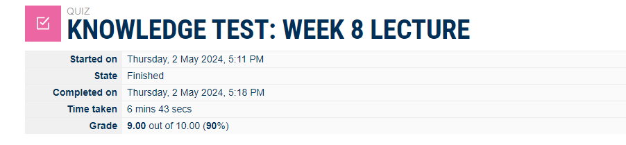

# Week 8 | Tutorial Activities

## Task 1. Complete the Knowledge Test

The screenshot:

## Task2. CIA Protections

Asset 1: Employee Database
Critical, Employee information, such as personal details and salary, should be kept confidential to prevent unauthorized access.
Any unauthorized or accidental changes to employee records could lead to errors or security breaches.
Access to employee records needs to be available to authorized personnel when required.

Asset 2: Customer Database
Customer data, including personal information and purchase history, must be protected to maintain trust.
Important. Ensuring the accuracy and reliability of customer records is crucial for business operations.
Important. Access to customer data is essential for customer service and business continuity.

Asset 3: Financial Transactions System
Financial transactions often involve sensitive information like credit card details, necessitating strong confidentiality measures.
Ensuring the accuracy and reliability of financial transactions is crucial for regulatory compliance and business trust.
Availability is crucial for uninterrupted financial operations and customer satisfaction.

Asset 4: Intellectual Property Repository
Protecting the confidentiality of intellectual property is essential to prevent unauthorized use or theft.
Important. Ensuring the integrity of IP ensures that no unauthorized alterations or modifications occur.
Access to IP repositories is critical for research, development, and collaboration.

Asset 5: Website Content and Design
Sensitive design or content elements may need confidentiality protection to prevent unauthorized use.
Website integrity is vital to maintaining the brand image and ensuring users receive accurate information.
Website availability is crucial for online presence and user interaction.

Asset 6: Communication Infrastructure 
Email communication often contains sensitive information, requiring confidentiality protection.
Ensuring the integrity of communication is essential to prevent unauthorized alterations or tampering.
Email availability is crucial for internal and external communication within the organization.

## Task3. Threat Sources and Motivation

Threat Source 1: Neighbour

Motivation: Wants to get free Internet access.
Explanation: The neighbour might attempt to gain unauthorized access to the wireless network to avoid paying for their own internet service. This could be driven by the desire to reduce personal expenses or simply take advantage of available resources.

Threat Source 2: Competitor Company
Motivation: Gathering competitive intelligence or disrupting business operations.
Explanation: A competitor company might have the motivation to gain insights into the target company's operations, steal sensitive information, or disrupt their network. This could be driven by a desire to gain a competitive advantage in the market or to harm the target company's reputation.
Threat Source 3: Disgruntled Employee

Motivation: Retaliation or personal gain.
Explanation: An employee who feels mistreated or is dissatisfied with their job may have the motivation to retaliate against the organization. This could involve intentional data breaches, spreading misinformation, or disrupting network services. Alternatively, the motivation might be personal gain, such as stealing company secrets for financial benefit.
Threat Source 4: Script Kiddies

Motivation: Thrill-seeking or malicious intent.
Explanation: Script kiddies are individuals with limited technical skills who use pre-existing hacking tools to exploit vulnerabilities. Their motivation could be driven by a desire for excitement, testing their skills, or even causing harm without a specific goal.
Threat Source 5: Hacktivist Group

## Task 4.  Explore Vulnerabilities

Accessing NVD:
Visit the National Vulnerability Database (NVD) at https://nvd.nist.gov/.
Search for each CVE ID to access detailed information.

Analyzing Base Score and CIA Impact:

Click on the Base Score of each CVE entry.
Navigate to the CVSS (Common Vulnerability Scoring System) calculator.
Look for the CIA impact under Impact Metrics.

Gathering Additional Information:

Look for links to vendor advisories in the CVE entry.
Visit the vendor advisories and search for details on company name, product description, and detection/mitigation strategies.

Reviewing CWE Description:

Visit the Common Weakness Enumeration (CWE) website at https://cwe.mitre.org/.
Search for each CVE's associated CWE ID and read the description.

Writing a Simple Explanation:

Synthesize the information from the CVE entry, CVSS calculator, CWE, and vendor advisory.
Use your own words to create a concise, simple explanation of each vulnerability.

Example Journal Entry:
Critical Vulnerability (CVE-2022-1000):

Base Score and CIA Impact: CVSS Base Score is 9.8 (Critical), with high confidentiality, integrity, and availability impact.
Company Name and Product Description: Refer to the vendor advisory for details.
Detection/Mitigation: Information available in the vendor advisory.

High Vulnerability (CVE-2022-2000):

Base Score and CIA Impact: CVSS Base Score is 7.5 (High), with significant confidentiality, integrity, and availability impact.
Company Name and Product Description: Refer to the vendor advisory for details.
Detection/Mitigation: Information available in the vendor advisory.

Medium Vulnerability (CVE-2022-3000):

Base Score and CIA Impact: CVSS Base Score is 5.0 (Medium), with moderate confidentiality, low integrity, and low availability impact.
Company Name and Product Description: Refer to the vendor advisory for details.

## Task 5. Vulnerability Disclosures

Vulnerability disclosure is a critical aspect of maintaining cybersecurity and finding the right balance between transparency and security is a complex challenge. In my viewpoint, several considerations come into play:

1. I believe in the importance of fostering responsible collaboration between security researchers and vendors. Open channels of communication allow for the efficient sharing of information and the development of effective mitigation strategies.

2. There's a delicate balance in determining reasonable timeframes for vendors to investigate and address vulnerabilities. While prompt action is essential, it's equally crucial to allow vendors sufficient time to conduct thorough investigations and develop robust patches.
3. Coordinated Disclosure:
I advocate for coordinated disclosure practices where security researchers and vendors work together to synchronize the release of information. This approach minimizes the risk of malicious exploitation while enabling users to protect themselves through timely updates.

4. Ethical considerations are paramount. Security researchers play a crucial role in safeguarding digital ecosystems, and they should approach vulnerability disclosure with a sense of responsibility. Publicly disclosing vulnerabilities without vendor consent should be a measure of last resort, considering the potential consequences.

5. I support the concept of bug bounty programs as an incentive for researchers to responsibly disclose vulnerabilities. These programs not only recognize the valuable contributions of researchers but also encourage them to report findings directly to vendors, promoting a more secure environment.
   
6. Users should be at the forefront of considerations. I believe that vendors have a responsibility to promptly notify users about potential risks and provide clear guidance on mitigation strategies. Transparency in communication is key to building and maintaining user trust.

